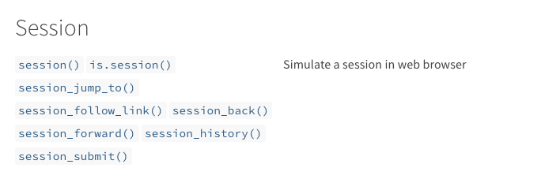

```{r include=FALSE}
library(tidyverse)
library(tweetrmd)
library(knitr)
library(magick)
library(janitor)
```


## Situation: run across data embedded in a webpage

- Tables in text (Wikipedia, news article)

- Daily reports (weather, stocks)

- Scores (sports, students)

---

## Example - [CO2 Emissions Rankings](https://www.ucsusa.org/resources/each-countrys-share-co2-emissions)

```{r, echo=FALSE, fig.align='center', out.width= "100%"}

```

---

## Goal: import data for analysis

```{r, echo=FALSE, fig.align='center'}

```

---

## Options

- Hand copy to spreadsheet
- Import the flat HTML

```{r}
url_emissions <- "https://www.ucsusa.org/resources/each-countrys-share-co2-emissions"
flat_emissions <- readLines(url_emissions)
head(flat_emissions)
```


- A better way????

---

## [rvest](https://rvest.tidyverse.org/index.html) helps you scrape (or harvest) data from web pages

```{r, echo=FALSE, fig.align='center', out.width="50%"}
knitr::include_graphics("images/rvest_hex.png")
```

---

```{r, echo = F}
tweetrmd::include_tweet("https://twitter.com/hadleywickham/status/1347260116932976643")
```


---

## Scraping emissions rankings with rvest

```{r}
# devtools::install_github(“tidyverse/rvest”)
library(rvest)
scrape_emissions <- rvest::read_html(url_emissions)
tables <- scrape_emissions %>% 
  html_elements("table") %>% 
  html_table()


```

---

## Scraping emissions with rvest

```{r}

tables[1]

```

---

## Key functions

- `read_html()` 
  - Returns an xml_document object. 

- `html_elements()` 
  - Extract specific components of the HTML.
  - Examples:
    - `html_elements("table")`
    - `html_elements("title")`
    - `html_elements("li")`

- `html_table()`
  - Converts tabular HTML data to data.frame (rvest_0.99.0.9000) or tibble (rvest_1.0.0)

---

## Finding the right CSS

```{r, echo=FALSE, fig.align='center', out.width="100%"}

```

---

## Finding the right CSS

- In the browser, "Developer tools" or right-click "Inspect"

```{r, echo=FALSE, fig.align='center', out.width="80%"}

```

- [Selector Gadget](https://rvest.tidyverse.org/articles/articles/selectorgadget.html)
  - "A JavaScript bookmarklet that allows you to interactively figure out what css selector you need to extract desired components from a page."
  - YMMV

---

## Finding the right CSS

```{r}
url_cookbooks <- "https://www.newyorker.com/culture/2020-in-review/the-best-cookbooks-of-2020"
scrape_cb <- read_html(url_cookbooks)

titles <- scrape_cb %>% 
  html_elements("strong") %>% 
  html_text2() %>% .[-1]

titles


```

---

## Finding the right CSS

```{r, echo=FALSE, fig.align='center', out.width="100%"}

```

---

## Finding the right CSS

```{r}
df.cookbooks <- data.frame(
  titles = scrape_cb %>% 
    html_elements("strong") %>%
    html_text2() %>% .[-1],
  links = scrape_cb %>% 
    html_elements("strong") %>% 
    html_elements(".external-link") %>% 
    html_attr("href")) %>% 
  separate(titles, 
           into = c("title", "author"),
           sep = " by ") %>%
  mutate(title = str_replace(title, ',”','”'))
```

---

```{r}

head(df.cookbooks, 4)

```

---

```{r, echo=FALSE, fig.align='center', out.width="100%"}

```

---

## Science and Art

```{r, echo=FALSE, fig.align='center', out.width="100%"}
 
```

---

## Science and Art

```{r, echo=FALSE, fig.align='center', out.width="100%"}
knitr::include_graphics("images/standings_table_with_css.png")
```

---

## Science and Art

```{r}
url_soccer <- "https://www.espn.com/soccer/standings/_/league/usa.1"
scrape_soccer <- read_html(url_soccer)

scrape_soccer %>% 
  html_element(".standings__table") %>%
  html_table()

```

---

## Science and Art

```{r}
scrape_soccer %>% 
  html_element(".standings__table") %>%
  html_table() %>%
  .[29:56, ]
```

---

## Science and Art

```{r, echo = F}
teams <- scrape_soccer %>% 
  html_element(".standings__table") %>% 
  html_table() %>% 
  .[1:28, ] %>%
  select(X1) 

stats <- scrape_soccer %>% 
  html_element(".standings__table") %>% 
  html_table() %>% 
  .[29:56, ] %>%
  select(-X1) 

```

```{r}
df.soccer <- bind_cols(teams, stats) %>%
  janitor::row_to_names(row_number = 1) %>%
  rename(team = `Eastern Conference`) %>%
  filter(!grepl('Conference',team)) %>%
  mutate(team = str_remove(team, "[2-9]|1[0-4]?")) %>%
  mutate(abbreviation = str_sub(team, 1,3),
         team = str_remove(team, "^.{0,3}"))
```

---

## Science and Art

```{r}
df.soccer
```

---

## Session functions

- [https://rvest.tidyverse.org/reference/index.html#section-session](https://rvest.tidyverse.org/reference/index.html#section-session)

```{r, echo=FALSE, fig.align='center', out.width="100%"}

```


---

## Other ideas

- Recipe app
- NLP with articles
- Social media 

- DREAM AND EXPLORE!


--- 

## References and Resources

- [rvest vignette: Web Scraping 101](https://rvest.tidyverse.org/articles/rvest.html)
- [Amelia McNamara's talk at noRth 2020](https://github.com/rnorthconference/2020Talks/tree/master/McNamara)
- [Kasia Kulma: Webscraping with R - from messy & unstructured to blisfully tidy](https://r-tastic.co.uk/post/from-messy-to-tidy/)